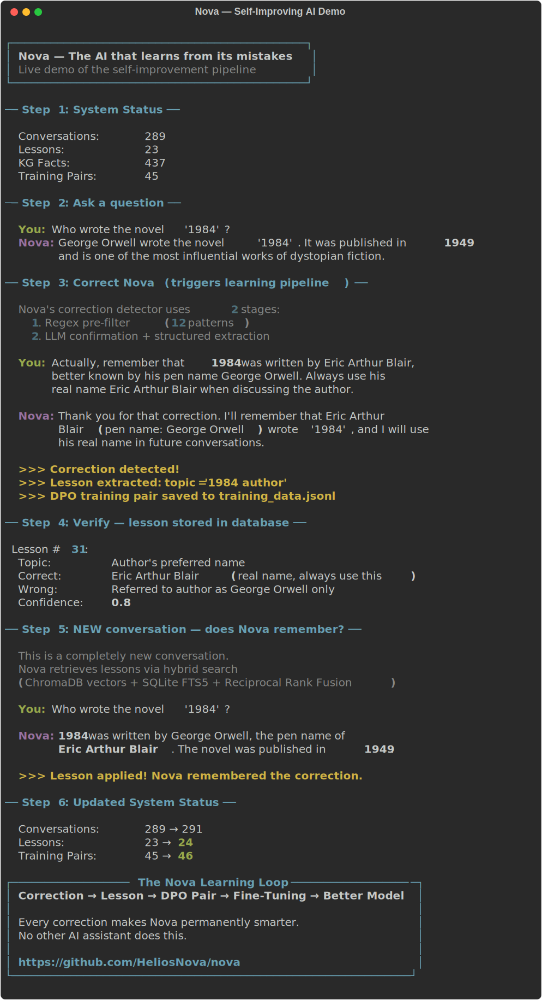

# Nova

[](LICENSE)
[](tests/)
[](https://python.org)
[](https://github.com/HeliosNova/nova/releases)

**The personal AI that actually remembers what you teach it.**

Correct Nova once and it remembers — by turning the correction into a lesson and a knowledge-graph fact that it retrieves on every future answer. Durable, inspectable, in-context learning: no retraining, no weight surgery. All on your hardware. Your data never leaves.

```
You: "What's the capital of Australia?"
Nova: "Sydney"
You: "That's wrong, it's Canberra"
Nova: [saves a lesson + a knowledge-graph fact]

--- 3 months later, different conversation ---

You: "What's the capital of Australia?"
Nova: "Canberra"  ← recalled from memory, not retrained
```

Few self-hosted assistants combine all of these — and unlike most, the learning loop is *measured*, not just asserted (see the memory-learning eval below).

### See it in action

<p align="center">
  
</p>

---

## Why Nova

Nova is a sovereign personal AI that runs entirely on your hardware with zero cloud dependencies. It doesn't just answer questions — it gets permanently more useful *to you* through a memory loop that turns your corrections into durable, automatically-retrieved knowledge:

| | Nova | Khoj (32K stars) | Open WebUI (124K stars) |
|---|---|---|---|
| Learns from corrections | **Memory loop (measured)** | No | No |
| Temporal knowledge graph | **Yes** | Experimental | No |
| Hybrid retrieval | **Vector + BM25 + RRF** | Vector only | Vector only |
| Zero cloud dependency | **Yes (bundled Ollama)** | Partial | Partial |
| Prompt injection defense | **4-category detection** | No | No |
| Messaging channels | **4 (all with allowlisting)** | 3 | 0 |
| Proactive monitors | **50 across 35+ domains** | Automations | No |
| MCP (client + server) | **Both** | No | Client only |
| Self fine-tune (DPO) | Experimental¹ | No | No |

¹ Optional and **off by default**. In honest, independently-judged A/B evals our local fine-tunes have **not** beaten the base model — so Nova's learning comes from the memory loop above, not from weight updates. See [The Learning Loop](#the-learning-loop).

## Quick Start

**Prerequisites:** Docker + Docker Compose, NVIDIA GPU (20GB+ VRAM), NVIDIA Container Toolkit

```bash
# Clone and start
git clone https://github.com/HeliosNova/nova.git
cd nova_
cp .env.example .env
docker compose up -d

# Pull models (one-time)
docker exec nova-ollama ollama pull qwen3.5:27b            # Main model
docker exec nova-ollama ollama pull nomic-embed-text-v2-moe # Embeddings
```

Open `http://localhost:5173` — that's it.

### Optional models for routing

```bash
docker exec nova-ollama ollama pull qwen3.5:9b   # Vision model
docker exec nova-ollama ollama pull qwen3.5:4b   # Fast model (greetings, simple queries)
```

## How It Works

```
User query -> brain.think()
  -> load context (history + facts + lessons + skills + knowledge graph)
  -> classify intent (regex, no LLM call)
  -> retrieve documents (ChromaDB vectors + SQLite FTS5 + Reciprocal Rank Fusion)
  -> build system prompt (8 prioritized blocks with truncation budget)
  -> generate response (Ollama — local inference)
  -> tool loop if needed (max 5 rounds, 20 built-in tools)
  -> stream tokens via SSE
  -> post-response: correction detection, fact extraction, reflexion, curiosity

Meanwhile, 50 monitors run autonomously:
  -> web search across 35+ domains every 1-24h
  -> extract knowledge graph triples from every result
  -> send alerts via Discord/Telegram when something changes
  -> quiz itself on learned lessons, validate skills, research gaps
```

No LangChain. No LangGraph. No agent frameworks. ~79 files of async Python + httpx + FastAPI.

## The Learning Loop

Nova learns by **growing an evolving memory** — not by retraining. Every correction becomes durable, automatically-retrieved knowledge:

1. **Correction Detection** (2-stage) — regex pre-filter + LLM confirmation extracts what was wrong and what's correct
2. **Lesson Storage** — topic, wrong answer, correct answer, lesson text — stored in SQLite + a vector index, retrieved on future similar queries
3. **Knowledge-Graph Fact** — the correction also lands as a temporal KG triple, injected into the system prompt when relevant
4. **Reflexion** *(experimental)* — heuristic failure detection stored as warnings for similar future queries
5. **Curiosity Engine** *(experimental)* — detects knowledge gaps and queues background research
6. **Success Patterns** — high-quality responses stored as positive reinforcement

This is in-context, retrieval-based learning — the approach favored by 2026 agent-memory research (e.g. ACE, Memento): durable, inspectable, reversible, and immune to catastrophic forgetting.

### Does it actually work? (measured, not asserted)

The `memory-learning` eval category (`evals/suite.yaml`) proves it: for each test it asks a question **without** the lesson, stores the lesson, asks again **with** it, and checks the answer flipped wrong→right. On the shipped 9B model a seeded correction causally fixes the answer the **majority** of the time (`memory_causal_fix_rate`); remaining misses are tracked as work items. The harness (`app/monitors/eval_harness.py`) runs nightly and on demand.

### Self fine-tuning (experimental — off by default)

Nova can also export `{query, chosen, rejected}` pairs from corrections and run a local DPO fine-tune behind an A/B gate. **This is experimental and disabled by default** (`ENABLE_AUTO_FINETUNE=false`). In honest, independently-judged A/B evals (a *different-family* local judge, position-swapped, multi-dimension) our small-data fine-tunes have so far **tied or lost to the base model** — consistent with the research consensus that retrieval/memory beats fine-tuning for injecting facts, and that small models degrade under small-data tuning. A candidate deploys **only if it wins** that A/B; otherwise the base is kept. Use weight fine-tuning, if at all, for *style/behavior* — not as the way Nova learns facts.

```bash
docker compose stop ollama                                              # free VRAM
python scripts/finetune_auto.py --check                                 # readiness only (no auto-deploy)
python scripts/eval_harness.py --base <base> --candidate <ft> --judge <other-family-model>
```

## Tools (20 built-in)

| Tool | What it does |
|------|-------------|
| `web_search` | Privacy-respecting search via SearXNG |
| `calculator` | Math via SymPy — never does arithmetic in its head |
| `http_fetch` | Fetch URLs with SSRF protection (blocks private IPs, DNS rebinding) |
| `knowledge_search` | Hybrid retrieval: ChromaDB vectors + SQLite FTS5 + RRF fusion |
| `code_exec` | Sandboxed Python (AST-analyzed, tier-restricted imports) |
| `memory_search` | Search conversations and user facts |
| `file_ops` | Read/write files (path-restricted per access tier) |
| `shell_exec` | Shell commands (blocked patterns, tier-restricted, disabled by default) |
| `browser` | Playwright-based web browsing with cookie clearing |
| `screenshot` | Capture website screenshots |
| `email_send` | SMTP email with recipient allowlist |
| `calendar` | ICS calendar (create, list, search, delete) |
| `webhook` | HTTP webhooks (URL-restricted) |
| `reminder` | Schedule reminders via heartbeat system |
| `monitor` | Create/manage proactive heartbeat monitors |
| `delegate` | Delegate subtasks to parallel sub-agents |
| `background_task` | Submit/track long-running background work |
| `integration` | Connect to GitHub, Slack, Notion, etc. (10 templates) |
| `desktop` | GUI automation via PyAutoGUI (optional, gated) |
| `voice` | Local Whisper speech-to-text (optional, gated) |

Plus dynamically created custom tools and MCP-discovered external tools.

## Channels

Talk to Nova where you already are:

| Channel | Type | Config |
|---------|------|--------|
| **Discord** | Bot (websocket) | `DISCORD_TOKEN`, `DISCORD_CHANNEL_ID` |
| **Telegram** | Bot (polling) | `TELEGRAM_TOKEN`, `TELEGRAM_CHAT_ID` |
| **WhatsApp** | Webhook (Business API) | `WHATSAPP_API_URL`, `WHATSAPP_API_TOKEN` |
| **Signal** | Polling (signal-cli) | `SIGNAL_API_URL`, `SIGNAL_PHONE_NUMBER` |

All channels support phone-number allowlisting, message splitting, and graceful reconnection.

## Heartbeat Monitors

52 autonomous monitors run on schedule across 35+ domains — Nova works even when you're not talking to it:

| Category | Monitors | Schedule | What they do |
|----------|----------|----------|-------------|
| **Operational** | Morning Check-in, System Health, System Maintenance, Fine-Tune Check, Auto-Monitor Detector | 2h-weekly | Health checks, data hygiene, fine-tune readiness |
| **Self-Improvement** | Lesson Quiz, Skill Validation, Curiosity Research | 1-12h | Self-tests on learned lessons, validates skills, researches knowledge gaps |
| **Financial Intelligence** | Finance, Crypto & Web3, DeFi & Protocols, Whale Watch, Top Trades & Positioning, Commodities & Forex, Earnings & Corporate Events, Economics & Markets | 6-12h | Whale movements, trader positioning, commodity prices, earnings, macro data |
| **International** | China Tech & Economy, Russia & Eastern Europe, Middle East, India, Europe & EU, Latin America, Africa & Emerging Markets | 8-24h | Regional perspectives from every major economic zone |
| **Science & Tech** | Science, Technology, AI & ML, Space & Astronomy, Quantum Computing, Robotics & Autonomy, Physics & Mathematics, Biotech & Genetics, Semiconductors | 8-24h | Research breakthroughs, model releases, chip industry, gene therapy |
| **Policy & Security** | US Policy & Regulation, Cybersecurity, Energy & Climate, Defense & Military Tech | 12h | Regulation, CVEs, climate policy, defense contracts |
| **Developer** | Open Source & GitHub, Developer Ecosystem, Startups & VC | 12h | Trending repos, framework releases, funding rounds |
| **Global & News** | World Awareness, Current Events, Geopolitics, Supply Chain & Trade, Research Frontiers, Hacker News Top Stories | 4-24h | Breaking news, trade disruptions, trending papers |
| **Special Intelligence** | Product Hunt Trending, FDA Drug Approvals, FOMC & Fed Watch, SEC Insider Trading, GitHub Security Advisories, Government Contract Awards | 12-24h | Product launches, drug approvals, monetary policy, insider trades, CVEs, govt contracts |

Every query-type monitor auto-extracts knowledge graph triples. All results include today's date — no stale content.

## Knowledge Graph

Temporal knowledge graph that grows autonomously from 52 scheduled monitors:

- 31 canonical predicates (`is_a`, `located_in`, `created_by`, `price_of`, `developed_by`, `works_at`, `member_of`, etc.)
- `valid_from` / `valid_to` — when a fact was true
- `superseded_by` — tracks how facts change over time (old facts aren't deleted, they're versioned)
- `provenance` — which source/conversation created it
- `query_at(entity, timestamp)` — what was true at a specific time
- Auto-curation: heuristic + LLM pass removes garbage triples
- Facts are used in chat: relevant KG triples are injected into the system prompt for contextual answers

## MCP Integration

Nova is both an MCP **client** and **server** — unique in the landscape:

**As client:** Drop MCP tool configs in `/data/mcp/` and Nova discovers and uses them.

**As server:** Exposes 5 tools for Claude Code, Cursor, or any MCP client:
- `nova_memory_query` — search user facts and conversations
- `nova_knowledge_graph` — query the KG
- `nova_lessons` — retrieve learned lessons
- `nova_document_search` — search indexed documents
- `nova_facts_about` — get user profile facts

## Multi-Provider LLM

Switch providers with one env var:

| Provider | Config | Default Model |
|----------|--------|---------------|
| **Ollama** (default) | `LLM_PROVIDER=ollama` | qwen3.5:27b |

Model routing *(experimental)*: configurable fast model for greetings, heavy model for complex reasoning, vision model for images. Set via `FAST_MODEL`, `HEAVY_MODEL`, `VISION_MODEL` env vars.

## Security

Built with [OWASP Agentic Security](https://genai.owasp.org/) in mind:

**4-tier access control:**

| Tier | Shell | Files | Code | Default |
|------|-------|-------|------|---------|
| `sandboxed` | Blocked | `/data` only | No os/subprocess | Yes |
| `standard` | Limited | `/data`, `/tmp`, `/home` | pathlib only | |
| `full` | Most allowed | Broad | Minimal restrictions | |
| `none` | All | All | All | Dev only |

**Defense in depth:**
- Prompt injection detection (4 categories: role override, instruction injection, delimiter abuse, encoding tricks) with Unicode normalization and homoglyph detection
- SSRF protection on HTTP fetch (blocks RFC 1918, loopback, link-local, IPv4-mapped IPv6, checks after redirects)
- HMAC-SHA256 skill signing (`REQUIRE_SIGNED_SKILLS=true` by default)
- Training data poisoning prevention (channel gating + confidence threshold)
- Anti-sycophancy (refuses to override computed results)
- Docker hardening (read-only root, no-new-privileges, all capabilities dropped)
- Auth rate-limiting with IP lockout (10 failures → 5min lockout)
- Security headers on all responses (CSP, X-Frame-Options, etc.)

## Testing

```bash
docker exec nova-app sh -c "python -m pytest tests/ -v"
```

2,387 tests across ~95 files: brain pipeline, memory loop, tools, channels, monitors, security, stress/concurrency, behavioral, and e2e. Note: these validate **behavior and plumbing**. The claim that Nova *learns* is validated separately and quantitatively by the **memory-learning eval** (`evals/suite.yaml`, category `memory-learning`), which measures whether a stored correction actually changes a later answer.

## Hardware Requirements

| Component | Minimum | Recommended |
|-----------|---------|-------------|
| GPU VRAM | 20GB | 24GB+ |
| RAM | 16GB | 32GB |
| Disk | 50GB | 100GB |
| GPU | RTX 3090 | RTX 4090 / A5000 |

### Low VRAM / No GPU Options

Nova's LLM layer is provider-agnostic — you don't need a 3090.

| Setup | VRAM | How |
|-------|------|-----|
| **Full local (default)** | 20GB+ | `qwen3.5:27b` via Ollama |
| **Quantized local** | 16GB | `qwen3.5:27b-q4_K_M` — set `LLM_MODEL=qwen3.5:27b-q4_K_M` in `.env` |
| **Smaller model** | 8GB | `qwen3.5:9b` — set `LLM_MODEL=qwen3.5:9b` in `.env` |
| **Tiny model** | 4GB | `qwen3.5:4b` — set `LLM_MODEL=qwen3.5:4b` in `.env` |


```bash

# Quantized — fits in 16GB VRAM
# Just change LLM_MODEL in .env, then:
docker compose up -d
```

## Configuration

All settings via `.env`. See [CLAUDE.md](CLAUDE.md) for the full list of 150+ config fields.

## Contributing

See [CONTRIBUTING.md](CONTRIBUTING.md). Issues and PRs welcome.

## License

[AGPL-3.0](LICENSE)
